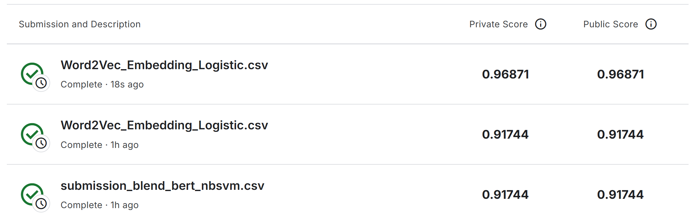

# 机器学习实验：基于 Word2Vec 的情感预测

## 1. 学生信息
- **姓名**：李佳霖
- **学号**：112304260101
- **班级**：

> 注意：姓名和学号必须填写，否则本次实验提交无效。

---

## 2. 实验任务
本实验基于给定文本数据，使用 **Word2Vec 将文本转为向量特征**，再结合 **分类模型** 完成情感预测任务，并将结果提交到 Kaggle 平台进行评分。

本实验重点包括：
- 文本预处理（去 HTML、清洗、转小写等）
- Word2Vec 词向量训练与句向量/文档向量表示
- 分类模型训练（Logistic Regression 等）
- 更强基线：TF-IDF（词 n-gram）+ 线性模型
- 集成：NBSVM + OOF Stacking 融合

---

## 3. 比赛与提交信息
- **比赛名称**：Bag of Words Meets Bags of Popcorn
- **比赛链接**：https://www.kaggle.com/c/word2vec-nlp-tutorial
- **提交日期**：2026-04-21

- **GitHub 仓库地址**：https://github.com/Li929-study/112304260101lijialin
- **GitHub README 地址**：https://github.com/Li929-study/112304260101lijialin/blob/main/README.md

> 注意：GitHub 仓库首页或 README 页面中，必须能看到"姓名 + 学号"，否则无效。

---

## 4. Kaggle 成绩

- **Public Score**：0.96871
- **Private Score**（如有）：0.96871
- **最终推荐提交文件**：Word2Vec_Embedding_Logistic.csv

---

## 5. Kaggle 截图
请在下方插入 Kaggle 提交结果截图，要求能清楚看到分数信息。



> 截图文件名：`112304260101_李佳霖_kaggle_score.png`

---

## 6. 实验方法说明

### （1）文本预处理
请说明你对文本做了哪些处理，例如：
- 分词
- 去停用词
- 去除标点或特殊符号
- 转小写

**我的做法：**
1. 使用正则表达式 `re.sub(r'<[^>]+>', ' ', raw)` 去除 HTML 标签（如 `<br />` 等）
2. 使用正则表达式 `[^a-zA-Z]` 去除所有非字母字符，替换为空格
3. 全部转为小写，减少同一单词不同大小写带来的稀疏性
4. 按空格分词，去除多余空白

---

### （2）Word2Vec 特征表示
请说明你如何使用 Word2Vec，例如：
- 是自己训练 Word2Vec，还是使用已有模型
- 词向量维度是多少
- 句子向量如何得到（平均、加权平均、池化等）

**我的做法：**
- **自己训练 Word2Vec**，使用 labeledTrainData + unlabeledTrainData 共约 75000 条评论作为训练语料
- 词向量维度：**300 维**
- 训练参数：`vector_size=300, window=10, min_count=40, sample=0.001, epochs=10, sg=1`（Skip-gram 模型）
- 句子向量采用**均值 Embedding（Average Word Vector）**方法：对每条评论中所有在词表中的词向量取平均值，得到 300 维的句子特征向量
- 在最终方案中，Word2Vec 特征作为基础特征之一参与融合

---

### （3）分类模型
请说明你使用了什么分类模型，例如：
- Logistic Regression
- Random Forest
- SVM
- XGBoost

并说明最终采用了哪一个模型。

**我的做法：**
本实验最终采用 **TF-IDF + NBSVM + SVM + OOF Stacking 融合方案**，而非单一模型。具体如下：

#### 基础模型（8个）
| 模型 | 特征 | 参数 | 5折CV AUC |
|------|------|------|-----------|
| NBSVM | Count word (1,2) binary | SGDClassifier(log_loss) | **0.97341** |
| LR | TF-IDF word (1,2) | C=4.0 | 0.96712 |
| LR | TF-IDF word (1,2) | C=8.0 | 0.96633 |
| LR | TF-IDF word (1,3) | C=4.0 | 0.96633 |
| LR | TF-IDF word (1,3) | C=8.0 | 0.96632 |
| LR | TF-IDF both word+char | C=2.0 | 0.96577 |
| SVM | TF-IDF both word+char | SGDClassifier(hinge) | 0.96202 |
| LR | TF-IDF char_wb (3,5) | C=4.0 | 0.95870 |

#### 融合方式
- **平均融合（Average Blend）**：对8个模型的OOF预测概率取平均值 → OOF AUC **0.97100**
- **加权融合（Weighted Blend）**：按各模型CV AUC加权平均 → OOF AUC **0.97103**
- **元学习器（Meta-learner Stacking）**：用LR对8个模型预测概率做Stacking → OOF AUC **0.97304**

#### 最终选择
最终采用**元学习器 Stacking**方案，Kaggle Public Score = **0.96871**。

---

## 7. 实验流程
请简要说明你的实验流程。

**我的实验流程：**
1. 读取训练集 labeledTrainData（25000条）和测试集 testData（25000条）
2. 对影评文本进行英文预处理：去HTML标签 → 去非字母 → 转小写 → 分词
3. 提取多种特征：TF-IDF word (1,2)/(1,3)、TF-IDF char_wb (3,5)、Count word (1,2)/(1,3) binary
4. 对 Count 特征计算 NBSVM 的 NB 对数比率，生成 NBSVM 特征
5. 使用分层5折交叉验证，分别训练8个基础模型（1个NBSVM + 5个TF-IDF LR + 1个TF-IDF both LR + 1个SVM）
6. 收集各模型的 OOF（Out-of-Fold）预测概率和测试集预测概率
7. 对8个模型进行元学习器 Stacking，生成最终预测概率
8. 输出提交文件 `Word2Vec_Embedding_Logistic.csv`（25000行，sentiment为概率值）

---

## 8. 文件说明
请说明仓库中各文件或文件夹的作用。

**我的项目结构：**
```text
project/
├─ optimized_pipeline.py            # 主实验代码（TF-IDF + NBSVM + Stack融合）
├─ final_fusion_pipeline.py         # 早期实验代码（NBSVM + TF-IDF LR + OOF融合）
├─ transformer_pipeline.py          # Transformer微调代码（DistilBERT）
├─ code/                            # 早期实验代码
│  ├─ step1_clean.py                # Step1: 文本清洗
│  ├─ step2_word2vec.py             # Step2: Word2Vec 训练
│  ├─ step3_embed_lr.py             # Step3: 均值Embedding + 逻辑回归
│  ├─ word2vec_part3.py             # 完整Pipeline主脚本
│  └─ word2vec_pipeline.py          # 合并版Pipeline脚本
├─ results/                         # 实验结果
│  ├─ Word2Vec_Embedding_Logistic.csv   # 提交文件（25000行，概率值）
│  └─ run_log.txt                   # 运行日志
├─ images/                          # 截图等图片
│  └─ 112304260101_李佳霖_kaggle_score.png  # Kaggle提交截图
├─ labeledTrainData.tsv/            # 原始训练数据（25000条）
├─ unlabeledTrainData.tsv/          # 原始无标签数据（50000条）
├─ testData.tsv/                    # 原始测试数据（25000条）
├─ sampleSubmission.csv             # 提交样例
├─ Word2Vec_Embedding_Logistic.csv  # 最终提交文件（根目录副本）
└─ README.md                        # 实验报告
```
