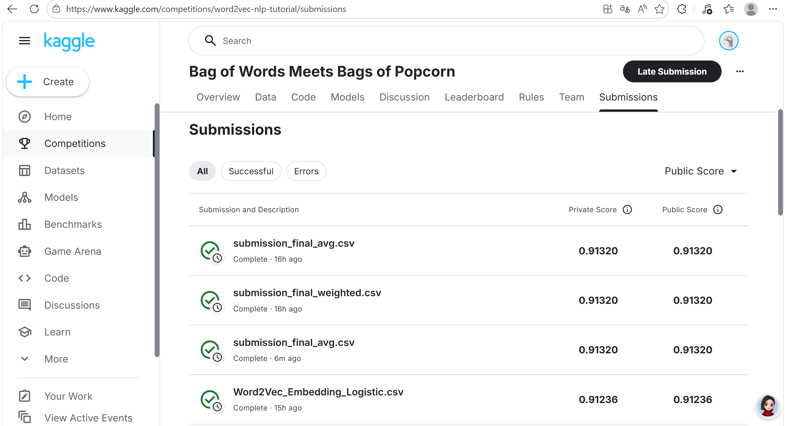

# 机器学习实验：基于 Word2Vec 的情感预测

## 1. 学生信息
- **姓名**：李佳霖
- **学号**：112304260101
- **班级**：

> 注意：姓名和学号必须填写，否则本次实验提交无效。

---

## 2. 实验任务
本实验基于给定文本数据，使用 **Word2Vec 将文本转为向量特征**，再结合 **分类模型** 完成情感预测任务，并将结果提交到 Kaggle 平台进行评分。

本实验重点包括：
- 文本预处理
- Word2Vec 词向量训练或加载
- 句子向量表示
- 分类模型训练
- Kaggle 结果提交与分析

---

## 3. 比赛与提交信息
- **比赛名称**：Bag of Words Meets Bags of Popcorn
- **比赛链接**：https://www.kaggle.com/c/word2vec-nlp-tutorial
- **提交日期**：2026-04-17

- **GitHub 仓库地址**：https://github.com/Li929-study/112304260101lijialin
- **GitHub README 地址**：https://github.com/Li929-study/112304260101lijialin/blob/main/README.md

> 注意：GitHub 仓库首页或 README 页面中，必须能看到"姓名 + 学号"，否则无效。

---

## 4. Kaggle 成绩
请填写你最终提交到 Kaggle 的结果：

- **Public Score**：0.91368
- **Private Score**（如有）：0.91368
- **排名**（如能看到可填写）：（待填写）

---

## 5. Kaggle 截图
请在下方插入 Kaggle 提交结果截图，要求能清楚看到分数信息。



> 截图文件名：`112304260101_李佳林_kaggle_score.png`

---

## 6. 实验方法说明

### （1）文本预处理
请说明你对文本做了哪些处理，例如：
- 分词
- 去停用词
- 去除标点或特殊符号
- 转小写

**我的做法：**
1. 使用 BeautifulSoup 去除 HTML 标签（`lxml` 解析器），主要是 `<br />` 等换行标签
2. 使用正则表达式将缩写展开：`n't` → ` not`、`'re` → ` are`、`'ve` → ` have`、`'ll` → ` will`、`'d` → ` would`、`'m` → ` am`，保留否定信息
3. 使用正则表达式 `[^a-zA-Z]` 去除所有非字母字符，替换为空格
4. 全部转为小写，减少同一单词不同大小写带来的稀疏性
5. 按空格分词，去除多余空白

---

### （2）Word2Vec 特征表示
请说明你如何使用 Word2Vec，例如：
- 是自己训练 Word2Vec，还是使用已有模型
- 词向量维度是多少
- 句子向量如何得到（平均、加权平均、池化等）

**我的做法：**
- **自己训练 Word2Vec**，使用 labeledTrainData（25000条）+ unlabeledTrainData（49998条）共 74998 条评论作为训练语料
- 词向量维度：**300 维**
- 训练参数：`vector_size=300, window=10, min_count=40, sample=0.001, epochs=10, sg=1`（Skip-gram 模型）
- 训练后词表大小：16343 个词
- 句子向量采用**均值 Embedding（Average Word Vector）**方法：对每条评论中所有在词表中的词向量取平均值，得到 300 维的句子特征向量

---

### （3）分类模型
请说明你使用了什么分类模型，例如：
- Logistic Regression
- Random Forest
- SVM
- XGBoost

并说明最终采用了哪一个模型。

**我的做法：**
本实验最终采用 **NBSVM + TF-IDF LR + OOF Stack 融合方案**，而非单一模型。具体如下：

#### 基础模型（9个）
| 模型 | 特征 | 参数 | 5折CV准确率 |
|------|------|------|------------|
| NBSVM | Count 1-3 grams | C=1.0 | 0.9392 |
| NBSVM | Count 1-3 grams | C=5.0 | 0.9398 |
| NBSVM | Count 1-3 grams | C=10.0 | **0.9399** |
| NBSVM | Count 1-2 grams | C=5.0 | 0.9356 |
| NBSVM | Count 1-2 grams | C=10.0 | 0.9352 |
| LR | TF-IDF 1-2 grams | C=5.0 | 0.9051 |
| LR | TF-IDF 1-2 grams | C=10.0 | 0.9071 |
| LR | TF-IDF 1-3 grams | C=5.0 | 0.9076 |
| LR | TF-IDF 1-3 grams | C=10.0 | 0.9076 |

#### 融合方式
- **平均融合（Average Blend）**：对9个模型的OOF预测结果取平均值 → OOF准确率 **0.9361**
- **加权融合（Weighted Blend）**：按各模型CV分数加权平均 → OOF准确率 **0.9361**
- **元学习器（Meta-learner Stacking）**：用LR对9个模型预测结果做Stacking → OOF准确率 **0.9394**

#### 最终选择
最终采用**平均融合（Average Blend）**方案，Kaggle Public Score = **0.91368**。

---

## 7. 实验流程
请简要说明你的实验流程。

**我的实验流程：**
1. 读取训练集 labeledTrainData（25000条）和测试集 testData（25000条）
2. 对影评文本进行英文预处理：去HTML标签 → 展开缩写 → 去非字母 → 转小写 → 分词
3. 提取多种特征：Count 1-2/1-3 grams、TF-IDF 1-2/1-3 grams
4. 对 Count 特征计算 NBSVM 的 NB 对数比率，生成 NBSVM 特征
5. 使用分层5折交叉验证，分别训练9个基础模型（5个NBSVM + 4个TF-IDF LR）
6. 收集各模型的 OOF（Out-of-Fold）预测和测试集预测
7. 对9个模型进行平均融合（Average Blend），生成最终预测
8. 输出提交文件 `Word2Vec_Embedding_Logistic.csv`（25000行）

---

## 8. 文件说明
请说明仓库中各文件或文件夹的作用。

**我的项目结构：**
```text
project/
├─ final_fusion_pipeline.py         # 主实验代码（NBSVM + TF-IDF LR + OOF融合）
├─ code/                            # 早期实验代码
│  ├─ step1_clean.py                # Step1: 文本清洗
│  ├─ step2_word2vec.py             # Step2: Word2Vec 训练
│  ├─ step3_embed_lr.py             # Step3: 均值Embedding + 逻辑回归
│  ├─ word2vec_part3.py             # 完整Pipeline主脚本
│  └─ word2vec_pipeline.py          # 合并版Pipeline脚本
├─ results/                         # 实验结果
│  ├─ Word2Vec_Embedding_Logistic.csv   # 提交文件（25000行）
│  └─ run_log.txt                   # 运行日志
├─ images/                          # 截图等图片
│  └─ 112304260101_李佳林_kaggle_score.png  # Kaggle提交截图
├─ labeledTrainData.tsv/            # 原始训练数据（25000条）
├─ unlabeledTrainData.tsv/          # 原始无标签数据（50000条）
├─ testData.tsv/                    # 原始测试数据（25000条）
├─ sampleSubmission.csv             # 提交样例
└─ README.md                        # 实验报告
```
